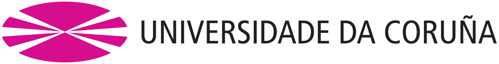

<div align="center">

  
  <h1>Programación de Sistemas</h1>
  <p>Repositorio para centralizar apuntes, materiales, ejercicios y recursos relacionados con la materia.</p>
  
<p>
  <a href="https://github.com/Meleagrista/udc-programacion-sistemas/graphs/contributors">
    
  </a>
  <a href="">
    
  </a>
  <a href="https://github.com/Meleagrista/udc-programacion-sistemas/stargazers">
    
  </a>
  <a href="https://github.com/Meleagrista/udc-programacion-sistemas/watchers">
    
  </a>
</p>

</div>
<br/>

<a id="top"></a>
<!-- <p align="right"><a href="#top">back to top</a></p> -->

# Sobre _Programación de Sistemas_
La asignatura **Programación de Sistemas** es una materia optativa del cuarto curso del **Grado en Ingeniería Informática**, de la mención de **Ingería de Computadores>**, impartida en el primer cuatrimestre y con una carga de **6 créditos**. 

> Programación de sistemas empotrados y dispositivos móviles

Más información en la **[guía docente oficial](https://guiadocente.udc.es/guia_docent/index.php?centre=614&ensenyament=614G01&assignatura=614G01058&idioma=cast&any_academic=2024_25)**.

<details>
  <summary>Tabla de Contenidos</summary>
  <ol>
    <li>
      <a href="#evaluación-de-la-materia">Evaluación de la materia</a>
      <ul>
        <li><a href="#criterios-de-evaluación-y-calificación">Criterios de evaluación y calificación</a></li>
        <li><a href="#calificaciones-de-las-prácticas-de-laboratorio">Calificaciones de las prácticas de laboratorio</a></li>
      </ul>
    </li>
    <li>
      <a href="#primeros-pasos">Primeros Pasos</a>
    </li>
    <li>
      <a href="#contribuir-al-proyecto">Contribuir al proyecto</a>
      <ul>
        <li><a href="#cómo-contribuir">¿Cómo contribuir?</a></li>
        <li><a href="#contribuyentes-destacados">Contribuyentes destacados</a></li>
      </ul>
    </li>
    <li><a href="#contactos">Contactos</a></li>
  </ol>
</details>


## Evaluación de la materia
La evaluación de la asignatura se basa en **prácticas de laboratorio** y un **trabajos tutelado**. A continuación, se detallan los criterios y métodos utilizados para la calificación de los estudiantes.

> [!Note]
> El curso de 2023/2024 no hubo examen final, el total de la nota fueron las practicas entregadas.

### Criterios de evaluación y calificación
Evaluación de los trabajos tutelados desarrollados por el alumno mediante pruebas mixtas.

Para el trabajo tuttelado se evlauna difernte elementos desde informes de seguimiento, el repositorio y el código fuente de la aplicación, la ficha de la app y la exposición del trabajo tutelado a través de un vídeo creado por los participantes.

Para las prácticas de laboratorio, hay que entregar las practicas que se empeiuzan en clasde, preferiblemnte el mismo día, con un plazo maximo de una semana.

> [!Warning]
> No nos dieron las notas de estas hasta el final, por lo que es muy dificil saber como vas.

### Calificaciones de las prácticas de laboratorio
Las siguientes tablas muestran las calificaciones obtenidas en las prácticas de laboratorio durante el curso.  

| Identificador |  Alumno             | Descripción                | Curso     | Calificación | Ranking | Comentario |
|-------------- |---------------------|----------------------------|-----------|------------- |---------|------------|
| p21           | Martín do Río Rico  | Activity and app resources | 2023/2024 | 85.00%       | 08/29   | - |
| p22           | Martín do Río Rico  | Intents                    | 2023/2024 | 92.50%       | 04/29   | - |
| p23           | Martín do Río Rico  | Fragments and Dialogs      | 2023/2024 | 80.00%       | 17/29   | - |
| p24           | Martín do Río Rico  | Layouts                    | 2023/2024 | 95.00%       | 02/29   | - |
| p25           | Martín do Río Rico  | Advanced UI                | 2023/2024 | 75.00%       | 17/29   | - |
| p26           | Martín do Río Rico  | Working in Background      | 2023/2024 | 97.50%       | 01/29   | - |
| p33           | Martín do Río Rico  | Data Management (I)        | 2023/2024 | 70.00%       | 21/29   | - |
| p34           | Martín do Río Rico  | Data Management (II)       | 2023/2024 | 60.00%       | 08/29   | - |

# Primeros pasos
Este proyecto consiste en la implementación de prácticas de desarrollo de aplicaciones móviles utilizando Android Studio, el entorno de desarrollo integrado (IDE) oficial para Android.

# Contribuir al proyecto
Si tienes una sugerencia para mejorar este proyecto, puedes hacer un **fork** del repositorio y crear un **pull request**, o simplemente abrir un **issue** para discutirlo.  

Todas las contribuciones son **enormemente apreciadas**. ¡Gracias por tu apoyo!  

## Cómo contribuir

1. Realiza un **fork** del proyecto.  
2. Crea una nueva rama para tu mejora.  

```bash
git checkout -b feature/<nueva caracteristica>
```
3. Realiza los cambios y haz un **commit**.  

```bash
git commit -m 'Añadir <nueva característica>'
```
4. Sube los cambios a tu rama.
```bash
git push origin feature/<nueva caracteristica>
```
5. Abre un **pull request** para revisión.  

## Contribuyentes Destacados  

<a href="https://github.com/Meleagrista/udc-programacion-sistemas/graphs/contributors">
  
</a>

</br>

# Contactos
Para cualquier consulta o sugerencia, puedes ponerte en contacto con:  

**Martín do Río Rico** – [mdoriorico@gmail.com](mailto:mdoriorico@gmail.com) 